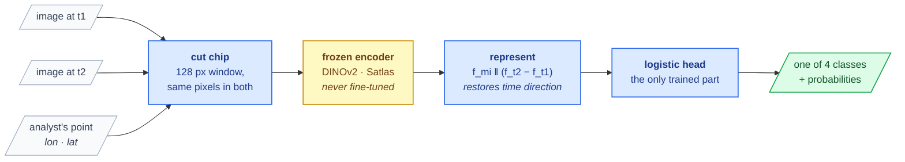

# Heritage Watch

[](https://github.com/whamidou006/heritage-watch-release)
[](tests)
[](LICENSE)

Tell an analyst **what** changed at a point they already found.

Given two aerial images of the same place — one earlier, one later — and a point
an analyst has marked, it returns one of four labels: New Construction, Solar
Panel, Destruction, Temporary Structure.

It does **not** search the image for changes. The locations are supplied.

| | |
|---|---:|
| **Macro-F1** (4 classes, spatially blocked CV) | **0.726** |
| Majority-class floor | 0.151 |
| Labels in the reference study | 879 |



Destruction and New Construction are the *same* two ground states in opposite
order. Telling them apart is the central difficulty — and the reason the
representation carries an explicit signed time difference.

## What it does

| | |
|---|---|
| **Classify a marked point** | four change classes from a before/after pair |
| **Frozen encoders** | DINOv2 ViT-B/14 and SatlasPretrain Aerial Swin-v2-B; no fine-tuning, no GPU training |
| **Honest protocol** | spatially blocked CV so neighbouring rooftops cannot straddle a fold |
| **A decision rule** | a difference counts only if it is unanimous, beats 2·SE, *and* reaches 0.02 |
| **Train on your own site** | one YAML template, four commands |
| **Transfer to a new site** | apply a trained bundle elsewhere, with compatibility checked before scoring |
| **Reproducible caches** | embeddings computed once; every published number re-fits in seconds |

Labels are **points, not masks**. This is not a change *localiser*, not
segmentation, and nothing is trained from scratch.

---

## Install

```bash
python -m venv .venv && source .venv/bin/activate
pip install -r requirements.txt
pip install -e .

heritage-watch --help
pytest -q                     # 42 tests, no data / weights / GPU needed
```

No install? `export PYTHONPATH=src` and replace `heritage-watch` with
`python -u -m heritage_watch.cli` everywhere below.

**Data is not included.** Obtain authorized copies from the dataset custodians;
encoder weights download on first use under their own licenses. There is no
public dataset URL or paper DOI.

## Quickstart

Point `HERITAGE_DATA_ROOT` at a dataset containing `Herat_all_changes.csv` and
`herat_site_sat_images/herat_site_TM_z19/*.tif`, then:

```bash
# 1. which points are usable, and why the others were dropped
heritage-watch manifest --config configs/herat.yaml --out cache/manifest.json
# → 879: New Construction 380, Solar Panel 308, Destruction 138, Temporary 53

# 2. score the selected representation
heritage-watch evaluate --config configs/herat.yaml \
  --features cache/features_month.npz cache/features_satlas_month.npz \
  --representation satlas_mi_si_diff
# → macro-F1 0.7259
```

Every dropped row carries a ledger reason. Relative paths inside a YAML resolve
against the YAML file, not your working directory.

## The three things you can do

### 1. Reproduce the study

```bash
heritage-watch reproduce --config configs/herat.yaml --from-cache cache/   # all 7 rows
heritage-watch compare   --config configs/herat.yaml \
  --features cache/features_month.npz cache/features_satlas_month.npz \
  --a satlas_mi_si_diff --b merged
```

To build features from scratch, drop `--from-cache`, or run `embed` yourself:

```bash
heritage-watch embed --config configs/herat.yaml --manifest cache/manifest.json \
  --encoder dinov2 --out cache/features_month.npz
heritage-watch embed --config configs/herat.yaml --manifest cache/manifest.json \
  --encoder satlas --out cache/features_satlas_month.npz
```

### 2. Train on your own site

Copy `configs/template_new_site.yaml` and adapt paths, CSV headers, taxonomy and
the scene-date regex.

```bash
heritage-watch manifest --config configs/my_site.yaml --out cache/my_manifest.json
heritage-watch embed    --config configs/my_site.yaml --manifest cache/my_manifest.json \
  --encoder satlas --out cache/my_satlas.npz
heritage-watch evaluate --config configs/my_site.yaml \
  --features cache/my_satlas.npz --representation satlas_mi_si_diff
heritage-watch train    --config configs/my_site.yaml \
  --features cache/my_satlas.npz --representation satlas_mi_si_diff --out out/model.joblib
```

`train` fits on **all** labels — its output is a model, **not a test score**. The
bundle records class order, representation, required encoders, chip size, feature
dimension, version, and a SHA-256 fingerprint of the ordered training data.

### 3. Evaluate transfer to another site

Requires the **same taxonomy, class order and chip size**, and comparable ground
resolution.

```bash
heritage-watch predict --model out/model.joblib \
  --config configs/new_site.yaml --out out/predictions.csv
```

Incompatible metadata or feature dimensions raise an error *before* scoring.
Compute transfer macro-F1 as in [NEW_SITE.md](docs/NEW_SITE.md).

> ⚠️ Running `evaluate` on the new site measures **within-site CV**, not transfer.

## Results

Eight paired jittered-grid replicates, five spatially grouped folds, n = 879.
Macro-F1 weights the four classes equally; majority floor **0.151**.

| Representation | CLI name | dim | Macro-F1 |
|---|---|---:|---:|
| DINOv2, post-event only | `dinov2_post` | 768 | 0.6439 |
| DINOv2, both + diff | `dinov2_both_diff` | 2304 | 0.6656 |
| Satlas-SI, post-event only | `satlas_si_post` | 1920 | 0.6698 |
| Satlas-SI, both + diff | `satlas_si_both_diff` | 5760 | 0.6918 |
| Satlas-MI, order-invariant | `satlas_mi` | 1920 | 0.6823 |
| **Satlas-MI + SI diff (selected)** | `satlas_mi_si_diff` | **3840** | **0.7259** |
| Merged DINOv2 + Satlas | `merged` | 8064 | 0.7062 |

Satlas-MI max-pools over time, so it is order-invariant and cannot by itself
separate Destruction from New Construction. The signed difference
`f_si_t2 − f_si_t1` restores direction. Satlas's four pyramid levels are
global-average-pooled and concatenated; DINOv2 resizes 128 px chips to 224 px
with ImageNet normalization, while Satlas uses native chips scaled to `[0,1]`.

**The top two are not separated.** The selected system wins 8/8 replicates by
+0.0197 — above 2·SE, but **0.0003 below** the 0.02 minimum effect. It is chosen
on parsimony: 3840 dimensions and one encoder family, versus 8064 and two.

## Honest limits

<details>
<summary><b>Read before quoting any number</b></summary>

- **Spatial blocking is not time blocking.** All acquisition pairs appear on both
  sides of every fold. The report's leave-one-interval-out diagnostic is
  directionally clear — a held-out interval is worse in 9 of 10 cases — but those
  published figures came from the superseded 838-sample manifest with test rows
  drawn *randomly* within the interval. `scripts/controls.py` now draws whole
  spatial cells and withholds them from both arms; that corrected diagnostic has
  not yet been published. The claim supported is "temporal generalisation is
  materially worse than the headline" and **no specific number**.
- **Destruction is weak.** Fixed-grid F1 **0.548**; **50.0 %** correct, **41.3 %**
  read as New Construction — the opposite temporal order of the same states.
  Those fixed-grid per-class figures use a different averaging scheme from the
  jittered headline and need not match `report()`.
- **Provenance fix was score-neutral.** Reading the layer month rather than the
  year changed which scenes back each pair; the strictly paired effect is
  +0.0067 on 811 shared points, inside the noise floor. Adopted on provenance,
  not accuracy. Different dataset versions hold different populations, so their
  headline differences cannot be attributed to this fix.
- **0.7259 is a lower bound, not a ceiling.** Encoders are frozen and untuned.
- **Not a deployment assurance.** Probabilities are uncalibrated, and any
  new-site claim needs independent ground truth.

</details>

## Reference study

Herat Old City, Afghanistan, 2009–2025 — 21 GeoTIFF scenes, 10 usable
acquisition pairs, 879 labels. Herat is on UNESCO's **Tentative List**, not an
inscribed World Heritage Site. Nominal resolution 0.25 m/px; the geographic
raster grid gives ≈0.247 × 0.297 m pixels, so the 128 px chip spans ≈32 × 38 m.

## Notes on running

| | |
|---|---|
| **Threads** | BLAS capped at 4 at import and call time; `HERITAGE_THREADS=2` on a shared host |
| **Device** | embedding defaults to CPU; GPU is explicit — `CUDA_VISIBLE_DEVICES=3 heritage-watch embed … --device cuda` |
| **Cache contents** | `f1`, `f2`, Satlas `fmi`, plus `y`, `pair`, `x`, `yy`, `fid` |
| **Cache safety** | rows and metadata must agree exactly — a row-order join is never assumed safe. Legacy caches lack chip-size provenance and warn on load |
| **Never** | load an untrusted joblib bundle |

Evaluating from cache is CPU-only and loads no encoders. A smoke test needs
neither full extraction nor the seven-model sweep.

Reference environment: Python 3.12, NumPy 2.5, sklearn 1.8, torch 2.8,
rasterio 1.5, timm 1.0.26.

## More

[Protocol and decision rule](docs/PROTOCOL.md) ·
[Results and solver fidelity](docs/RESULTS.md) ·
[New-site instructions](docs/NEW_SITE.md) ·
[Contributing](CONTRIBUTING.md) · [License](LICENSE)

Tests build synthetic GeoTIFFs under ignored `out/pytest-work/`, never in a
system temp directory.

Until a paper identifier exists, cite the software — do not invent one:

> Heritage Watch contributors. *Heritage Watch: Semantic Change Classification
> on Bi-temporal Aerial Imagery*. Software, version 1.0.0, 2026.

Please also cite the original DINOv2 and SatlasPretrain work.
